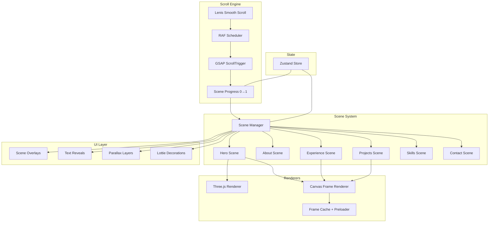

# Cinematic Scrollytelling Portfolio — Architecture & Implementation Plan

## Background & Current State

The existing `resume` project at `c:\Users\neera\Documents\Visual Studio Code\resume` already has:
- React 19 + Vite 8 + TypeScript + Tailwind CSS v4
- GSAP 3.15 + ScrollTrigger, Lenis smooth scrolling
- A working `ScrollytellingPage.tsx` with canvas frame-sequence scrubbing, 6 video sections, overlay system, nav dots
- Frame assets in `src/assets/frames/video1-6/` (JPG sequences)
- Resume content data in `src/data/resumeContent.ts`

> [!NOTE]
> The Iron Man Jet reference uses **Next.js + Framer Motion + Lenis + Tailwind v4** (no GSAP). Our architecture keeps the existing **Vite + GSAP** stack per requirements, but adopts the reference's cinematic interaction patterns: scroll-driven frame scrubbing, pinned immersive scenes, layered text reveals, and film-like transitions.

The goal is to **refactor the monolithic `ScrollytellingPage.tsx`** into a modular, production-grade scrollytelling engine that scales to 6+ scenes with independent timelines, layered parallax, and optional Three.js/Lottie integration.

---

## User Review Required

> [!IMPORTANT]
> **New dependencies required**: `zustand`, `framer-motion`, `three`, `@react-three/fiber`, `@react-three/drei`, `lottie-web`. Confirm you're okay with adding these.

> [!IMPORTANT]
> **Target workspace**: All code goes into `c:\Users\neera\Documents\Visual Studio Code\portfolio` (currently empty except `.git`). This means we're building a **new project** in the portfolio workspace, not modifying the resume project. Alternatively, we refactor in-place in the `resume` workspace. **Which do you prefer?**

> [!WARNING]
> **Frame assets**: The current 6 video folders contain ~1,600+ JPG frames. For production, these should be converted to WebP. Should I include an ffmpeg conversion script, or will you handle asset optimization separately?

---

## Open Questions

1. **Workspace target** — Build fresh in `portfolio/` or refactor the existing `resume/` project?
2. **Three.js hero** — What visual do you want? Options: rotating geometric mesh, particle field, wireframe globe, or abstract shader plane. All controlled by scroll progress.
3. **Lottie animations** — Do you have specific Lottie JSON files, or should I include placeholder decorative animations?
4. **Domain/deployment** — Vercel? Any specific meta/OG requirements?

---

## Proposed Changes

### Architecture Overview



### Rendering Pipeline

```
User Scroll Input
  → Lenis intercepts & normalizes (lerp: 0.1, smoothWheel: true)
  → Lenis.on('scroll') fires ScrollTrigger.update()
  → ScrollTrigger calculates per-scene progress (0→1)
  → Progress dispatched to Zustand store
  → Active scene's timeline/canvas/Three.js updates via RAF
  → Canvas draws interpolated frame OR Three.js updates camera
  → Overlay/text animations update via GSAP scrub
  → Single RAF loop, no competing animation frames
```

---

### 1. Core Infrastructure

- [x] #### [NEW] `src/lib/gsap.ts`
GSAP registration and configuration singleton. Registers ScrollTrigger plugin once, exports configured gsap instance.

```typescript
import gsap from 'gsap';
import { ScrollTrigger } from 'gsap/ScrollTrigger';
gsap.registerPlugin(ScrollTrigger);
export { gsap, ScrollTrigger };
```

- [x] #### [NEW] `src/lib/lenis.ts`
Lenis factory with RAF synchronization. Creates a singleton Lenis instance that pipes into GSAP's ticker instead of running its own RAF loop.

```typescript
// Key pattern: unified RAF loop
// Lenis drives scroll → GSAP ticker updates ScrollTrigger
gsap.ticker.add((time) => { lenis.raf(time * 1000); });
gsap.ticker.lagSmoothing(0); // prevent GSAP from throttling
```

- [x] #### [NEW] `src/lib/rafScheduler.ts`
Centralized requestAnimationFrame orchestrator. Prevents multiple RAF loops from competing. Exposes `schedule(callback, priority)` for canvas draws, Three.js renders, and UI updates.

- [x] #### [NEW] `src/lib/performance.ts`
Runtime performance detection: device tier (low/mid/high), preferred frame count, canvas DPR cap, reduced-motion flag. Used by scenes to adapt quality.

```typescript
export interface DeviceProfile {
  tier: 'low' | 'mid' | 'high';
  maxDPR: number;
  maxFrames: number;
  prefersReducedMotion: boolean;
  isLowPower: boolean;
}
```

- [x] #### [NEW] `src/lib/sequenceLoader.ts`
Progressive frame loader with batched preloading, priority queue, and abort support. Loads frames using `createImageBitmap()` for off-main-thread decoding when available.

- [x] #### [NEW] `src/lib/frameCache.ts`
LRU frame cache with configurable memory budget. Evicts frames from inactive scenes. Tracks memory pressure via `performance.memory` API when available.

```typescript
export class FrameCache {
  private cache: Map<string, ImageBitmap | HTMLImageElement>;
  private maxEntries: number;
  // LRU eviction, scene-aware priority
  get(key: string): CachedFrame | undefined;
  set(key: string, frame: CachedFrame, priority: number): void;
  evictScene(sceneId: string): void;
}
```

---

### 2. Type System

#### [NEW] `src/types/scene.ts`

```typescript
export interface SceneConfig {
  id: string;
  label: string;
  pinDuration?: number;        // vh units for pin (default: 300)
  scrollRange?: [number, number]; // normalized start/end within page
  sequence?: SequenceConfig;
  timeline?: GSAPTimelineConfig;
  overlays?: OverlayConfig[];
  parallaxLayers?: ParallaxLayer[];
  transitions?: TransitionConfig;
  threeScene?: boolean;
  lottie?: LottieConfig;
  hooks?: SceneHooks;
}

export interface SceneHooks {
  onEnter?: (progress: number) => void;
  onLeave?: (progress: number) => void;
  onProgress?: (progress: number) => void;
  onActivate?: () => void;
  onDeactivate?: () => void;
}

export interface OverlayConfig {
  content: React.ReactNode;
  enterAt: number;   // progress 0→1
  exitAt: number;
  position?: 'center' | 'left' | 'right' | 'bottom';
  animation?: 'fade-up' | 'slide-left' | 'typewriter' | 'split-text';
}

export interface ParallaxLayer {
  content: React.ReactNode;
  speed: number;     // multiplier: 0.5 = half scroll speed
  zIndex: number;
  opacity?: [number, number]; // start/end opacity
}

export interface TransitionConfig {
  enter: 'fade' | 'wipe' | 'zoom' | 'none';
  exit: 'fade' | 'wipe' | 'zoom' | 'none';
  duration?: number;
}
```

#### [NEW] `src/types/sequence.ts`

```typescript
export interface SequenceConfig {
  folder: string;
  prefix: string;
  startIndex: number;
  endIndex: number;
  extension?: 'jpg' | 'webp' | 'avif';
  preloadStrategy?: 'eager' | 'lazy' | 'viewport';
  preloadRadius?: number;
  interpolation?: 'nearest' | 'linear';
}

export interface ScrollRange {
  start: string;   // ScrollTrigger start value e.g. "top top"
  end: string;
  scrub: number | boolean;
}
```

---

### 3. Scroll Store (Zustand)

- [x] #### [NEW] `src/components/scrolly/scrollStore.ts`

```typescript
import { create } from 'zustand';

interface ScrollState {
  globalProgress: number;      // 0→1 across entire page
  activeSceneId: string;
  activeSceneIndex: number;
  sceneProgress: number;       // 0→1 within active scene
  scrollVelocity: number;
  isScrolling: boolean;
  direction: 'up' | 'down';
  // Actions
  setGlobalProgress: (p: number) => void;
  setActiveScene: (id: string, index: number) => void;
  setSceneProgress: (p: number) => void;
  setScrollVelocity: (v: number) => void;
  setIsScrolling: (s: boolean) => void;
  setDirection: (d: 'up' | 'down') => void;
}
```

Zustand chosen over Context API because scroll state updates at 60fps — Context would cause cascading re-renders across the entire tree. Zustand's selector pattern ensures only subscribed components re-render.

---

### 4. Scrollytelling Engine Components

- [x] #### [NEW] `src/components/scrolly/ScrollyPage.tsx`
Top-level orchestrator. Initializes Lenis, sets up global ScrollTrigger, renders Scene components. Manages the unified RAF loop.

**Responsibilities:**
- Lenis initialization + GSAP ticker sync
- Global scroll progress tracking
- Scene registration and ordering
- Resize handling with debounced ScrollTrigger.refresh()
- Cleanup on unmount

- [x] #### [NEW] `src/components/scrolly/Scene.tsx`
Generic scene wrapper. Accepts `SceneConfig`, creates ScrollTrigger pin, manages scene lifecycle.

```tsx
interface SceneProps {
  config: SceneConfig;
  children: React.ReactNode;
  index: number;
}
// Creates a pinned section with height = pinDuration * vh
// ScrollTrigger scrubs progress 0→1 over the pin
// Calls config.hooks on lifecycle events
// Activates/deactivates child renderers based on visibility
```

- [x] #### [NEW] `src/components/scrolly/ImageSequenceCanvas.tsx`
Canvas-based frame renderer. Receives `sequenceConfig` + `progress` (0→1), maps progress to frame index, draws to canvas.

**Key implementation details:**
- Canvas sized at `window.innerWidth * DPR` × `window.innerHeight * DPR` (capped at 2x)
- Cover-fit drawing (matches current `drawFrame` logic)
- Uses `createImageBitmap` for async decoding when supported
- Frame interpolation: snaps to nearest frame (not sub-frame blending)
- Skips redundant draws via draw-key deduplication
- Integrates with `FrameCache` for LRU memory management

- [x] #### [NEW] `src/components/scrolly/SceneOverlay.tsx`
Glassmorphic content overlay positioned over the canvas. Handles enter/exit animations via GSAP scrub.

- [x] #### [NEW] `src/components/scrolly/SceneTextReveal.tsx`
Text animation component supporting multiple reveal styles: fade-up, split-text (per-character), typewriter, slide-in. All driven by scroll progress.

- [x] #### [NEW] `src/components/scrolly/SceneProgress.tsx`
Visual progress indicator — thin accent-colored bar at top of viewport showing scene progress.

- [x] #### [NEW] `src/components/scrolly/VideoScrub.tsx`
Alternative to ImageSequenceCanvas for browsers/scenes where video scrubbing is preferred. Uses `<video>` element with `currentTime` mapped to scroll progress. Fallback only — canvas is primary.

---

### 5. Custom Hooks

- [x] #### [NEW] `src/components/scrolly/useScrollSync.ts`
Connects Lenis scroll events to GSAP ScrollTrigger. Handles the critical Lenis↔GSAP bridge.

```typescript
export function useScrollSync() {
  // 1. Create Lenis instance
  // 2. Pipe Lenis into gsap.ticker
  // 3. Update Zustand store with velocity/direction
  // 4. Return lenis ref for external control
}
```

- [x] #### [NEW] `src/components/scrolly/usePinnedScene.ts`
Creates a ScrollTrigger pin for a scene element. Returns progress ref and lifecycle callbacks.

```typescript
export function usePinnedScene(
  triggerRef: RefObject<HTMLElement>,
  config: { pinDuration: number; scrub: number; onProgress: (p: number) => void }
)
```

- [x] #### [NEW] `src/components/scrolly/useSceneProgress.ts`
Subscribes to Zustand store for a specific scene's progress. Uses `useRef` to avoid re-renders — exposes progress via ref.

- [x] #### [NEW] `src/components/scrolly/useImageSequence.ts`
Manages frame loading, preloading, caching, and drawing for a single sequence. Refactored from current `ScrollytellingPage` logic into a composable hook.

- [x] #### [NEW] `src/components/scrolly/useReducedMotion.ts`
`prefers-reduced-motion` media query hook. Returns boolean. When true, scenes skip to static keyframes instead of animating.

---

### 6. Section Components

Each section is a scene configuration + custom content. All use the `Scene` wrapper.

- [x] #### [MODIFY] `src/components/sections/HeroSection.tsx`
Cinematic hero with Three.js background OR frame sequence. Full-viewport pinned scene. Text: name, title, "scroll to explore" prompt. Parallax layers with depth.

- [x] #### [NEW] `src/components/sections/AboutSection.tsx`  
Split-screen: frame sequence left, text reveal right. Skills highlights with staggered fade-in.

- [x] #### [MODIFY] `src/components/sections/ExperienceSection.tsx`
Timeline layout pinned over frame sequence. Each role animates in as scroll progresses. Cards slide in from alternating sides.

- [x] #### [MODIFY] `src/components/sections/ProjectsSection.tsx`
Showcase cards that scale up from thumbnails as user scrolls. Each project gets a sub-scene with its own frame range.

- [x] #### [NEW] `src/components/sections/SkillsSection.tsx`
Animated skill grid/visualization. Could use Lottie for decorative elements. Staggered reveals driven by scroll.

- [x] #### [NEW] `src/components/sections/ContactSection.tsx`
Outro scene with contact links. Reverse-parallax effect pulling content together. Final frame sequence holds on last frame.

---

### 7. Three.js Hero Scene

- [x] #### [NEW] `src/components/three/HeroThreeScene.tsx`

**Constraints:** Single isolated `<canvas>`, not a site-wide WebGL context. Lazy-loaded via `React.lazy()`.

**Design:**
- Floating geometric wireframe mesh (icosahedron or custom) 
- Scroll progress controls: camera orbit position, mesh rotation, bloom intensity
- Minimal shader: holographic/wireframe effect with accent color (#22c55e)
- Uses `@react-three/fiber` for React integration, `@react-three/drei` for helpers

**Sync with scroll:**
```typescript
useFrame(() => {
  const progress = scrollStore.getState().sceneProgress;
  camera.position.lerp(targetPosition(progress), 0.05);
  mesh.rotation.y = progress * Math.PI * 2;
  bloomPass.intensity = 0.5 + progress * 1.5;
});
```

**Performance:** Renders only when hero scene is active (IntersectionObserver). Disposes geometry/textures on scene exit. Max 60fps, auto-downgrades on low-tier devices.

---

### 8. Animation Strategy

| Context | Tool | Why |
|---------|------|-----|
| Scroll-driven timelines | GSAP ScrollTrigger | Scrub precision, pin support, native scroll binding |
| Frame sequence scrubbing | Canvas 2D + custom hook | Direct pixel control, no DOM overhead |
| UI micro-interactions | Framer Motion | Declarative enter/exit, gesture support, layout animations |
| Decorative vectors | Lottie | Lightweight, designer-friendly, resolution-independent |
| Hero 3D scene | Three.js | GPU shaders, camera interpolation |
| Hover/focus states | CSS transitions | Zero JS overhead for simple state changes |

**GPU acceleration rules:**
- Only animate `transform` and `opacity` — never `width`, `height`, `top`, `left`
- Use `will-change: transform` sparingly, only on actively animating elements
- Use `contain: layout style paint` on scene containers
- Composite layers: canvas elements auto-promote; overlays use `translateZ(0)`

**Easing:** `power2.inOut` for cinematic transitions, `power1.out` for text reveals, `none` (linear) for frame scrubbing.

---

### 9. Performance Engineering

**60fps Strategy:**
1. **Single RAF loop** — Lenis pipes into GSAP ticker; no competing `requestAnimationFrame` calls
2. **No React re-renders on scroll** — All scroll state in refs + Zustand selectors, never in React state
3. **Canvas optimization** — Skip redundant draws (draw-key dedup), DPR capped at 2x, `imageSmoothingEnabled: false` for pixel-art sequences
4. **Lazy scene activation** — `IntersectionObserver` activates/deactivates scenes ±1 viewport ahead
5. **Frame preloading** — Priority queue: current frame ±5 high priority, ±30 medium, rest low
6. **Memory management** — LRU cache evicts inactive scene frames; target <200MB total
7. **Code splitting** — Three.js hero lazy-loaded (~150KB), Lottie lazy-loaded (~50KB)
8. **Image decoding** — `createImageBitmap()` decodes off main thread, `img.decoding = 'async'`

**Mobile optimizations:**
- Reduce frame count (skip every 2nd frame on `deviceProfile.tier === 'low'`)
- Cap DPR at 1.5 on mobile
- Disable parallax layers on touch devices
- Reduce preload radius to ±10 frames
- Use `passive: true` on all scroll listeners

**Asset optimization (ffmpeg pipeline):**
```bash
# Extract frames from video
ffmpeg -i input.mp4 -vf "fps=30,scale=1920:-1" frames/frame_%04d.jpg

# Convert to WebP (recommended: 60-80% smaller)
for f in frames/*.jpg; do
  cwebp -q 82 "$f" -o "${f%.jpg}.webp"
done

# Optimal frame counts per scene:
# Hero: 120-180 frames (6s at 30fps)
# Content sections: 60-120 frames (2-4s)
# Transitions: 30-60 frames (1-2s)
```

---

### 10. Accessibility + Reduced Motion

```typescript
// useReducedMotion.ts
export function useReducedMotion(): boolean {
  const [reduced, setReduced] = useState(
    () => window.matchMedia('(prefers-reduced-motion: reduce)').matches
  );
  useEffect(() => {
    const mq = window.matchMedia('(prefers-reduced-motion: reduce)');
    const handler = (e: MediaQueryListEvent) => setReduced(e.matches);
    mq.addEventListener('change', handler);
    return () => mq.removeEventListener('change', handler);
  }, []);
  return reduced;
}
```

**When `prefers-reduced-motion` is active:**
- Frame sequences show static keyframe (first, middle, or last frame)
- GSAP scrub disabled — content appears statically
- Three.js scene shows static camera position, no rotation
- Lottie animations pause on first frame
- Parallax layers flatten (speed = 1)
- All CSS transitions set to 0ms

**Semantic structure:**
- Each scene is a `<section>` with `aria-label`
- Nav dots have `aria-current` for active scene
- Skip-to-content link at page top
- Focus management: visible focus rings, logical tab order
- Heading hierarchy: single `<h1>` in hero, `<h2>` per scene

---

### 11. Project Structure (Final)

```
src/
├── components/
│   ├── scrolly/
│   │   ├── ScrollyPage.tsx          # Top-level orchestrator
│   │   ├── Scene.tsx                # Generic pinned scene wrapper
│   │   ├── ImageSequenceCanvas.tsx   # Canvas frame renderer
│   │   ├── VideoScrub.tsx           # Video element fallback
│   │   ├── SceneOverlay.tsx         # Glassmorphic content overlay
│   │   ├── SceneTextReveal.tsx      # Text animation component
│   │   ├── SceneProgress.tsx        # Progress bar indicator
│   │   ├── SceneNav.tsx             # Floating nav dots
│   │   ├── scrollStore.ts          # Zustand state
│   │   ├── useScrollSync.ts        # Lenis ↔ GSAP bridge
│   │   ├── usePinnedScene.ts       # ScrollTrigger pin hook
│   │   ├── useSceneProgress.ts     # Per-scene progress hook
│   │   ├── useImageSequence.ts     # Frame loading/drawing hook
│   │   └── useReducedMotion.ts     # a11y motion preference
│   │
│   ├── sections/
│   │   ├── HeroSection.tsx
│   │   ├── AboutSection.tsx
│   │   ├── ExperienceSection.tsx
│   │   ├── ProjectsSection.tsx
│   │   ├── SkillsSection.tsx
│   │   └── ContactSection.tsx
│   │
│   └── three/
│       └── HeroThreeScene.tsx       # Lazy-loaded Three.js scene
│
├── lib/
│   ├── gsap.ts                     # GSAP + plugin registration
│   ├── lenis.ts                    # Lenis factory + config
│   ├── sequenceLoader.ts           # Progressive frame loader
│   ├── frameCache.ts               # LRU frame cache
│   ├── rafScheduler.ts             # Unified RAF orchestrator
│   └── performance.ts              # Device profiling
│
├── data/
│   └── resumeContent.ts            # Existing content data
│
├── types/
│   ├── scene.ts                    # Scene/overlay/parallax types
│   └── sequence.ts                 # Frame sequence types
│
├── assets/
│   ├── frames/                     # Existing video1-6 folders
│   ├── lottie/                     # Lottie JSON files
│   └── textures/                   # Three.js textures
│
├── styles/
│   └── globals.css                 # Tailwind v4 + design tokens
│
├── App.tsx
└── main.tsx
```

---

### 12. Lenis + GSAP Integration (Detailed)

```typescript
// lib/lenis.ts
import Lenis from 'lenis';
import { gsap, ScrollTrigger } from './gsap';

let lenisInstance: Lenis | null = null;

export function createLenis(): Lenis {
  if (lenisInstance) return lenisInstance;

  const lenis = new Lenis({
    lerp: 0.1,
    smoothWheel: true,
    syncTouch: true,        // normalize touch scrolling
    touchMultiplier: 1.5,
  });

  // CRITICAL: Pipe Lenis into GSAP ticker for unified RAF
  lenis.on('scroll', ScrollTrigger.update);
  gsap.ticker.add((time) => lenis.raf(time * 1000));
  gsap.ticker.lagSmoothing(0);

  lenisInstance = lenis;
  return lenis;
}

export function destroyLenis(): void {
  lenisInstance?.destroy();
  lenisInstance = null;
}
```

### 13. Example Scene Lifecycle

```
1. ScrollyPage mounts → createLenis() → unified RAF starts
2. Scene components mount → each registers ScrollTrigger pin
3. User scrolls into Hero scene:
   a. IntersectionObserver fires → scene activates
   b. useImageSequence starts preloading hero frames
   c. ScrollTrigger.onUpdate fires with progress 0→1
   d. progress mapped to frame index: Math.round(progress * (frameCount - 1))
   e. ImageSequenceCanvas draws frame to canvas
   f. SceneOverlay fades in at progress 0.1, fades out at 0.9
   g. SceneTextReveal animates title at progress 0.2→0.4
4. User scrolls past Hero scene:
   a. ScrollTrigger.onLeave fires
   b. Hero scene deactivates → frame cache eligible for eviction
   c. Next scene (About) activates
5. On unmount → destroyLenis() + gsap.context.revert()
```

---

### 14. Production Deployment

- [x] **Build**: `vite build` with `rollupOptions.output.manualChunks` for Three.js/Lottie
- [ ] **Assets**: Serve frames from CDN with aggressive caching (`Cache-Control: immutable`)
- [ ] **Compression**: Brotli for JS/CSS, WebP for frames
- [x] **Preload**: `<link rel="preload">` for first 5 hero frames
- [ ] **Metrics**: Track LCP (hero first frame), FID, CLS, frame drop rate
- [x] **Fallback**: If WebGL unavailable, hero falls back to frame sequence

---

## Verification Plan

#### Automated Tests
- [x] `npm run build` — TypeScript compilation + Vite production build passes
- [ ] Lighthouse performance audit targeting >90 score
- [x] `npm run dev` — visual verification in browser

#### Manual Verification
- [ ] Scroll through all 6 scenes on desktop Chrome/Firefox/Safari
- [ ] Test on mobile (Chrome Android, Safari iOS)
- [x] Verify `prefers-reduced-motion` behavior
- [ ] Verify keyboard navigation through scenes
- [ ] Check frame drop rate in Chrome DevTools Performance panel (target: <5% dropped frames)
- [ ] Memory profiling: confirm <300MB peak on desktop, <150MB on mobile
